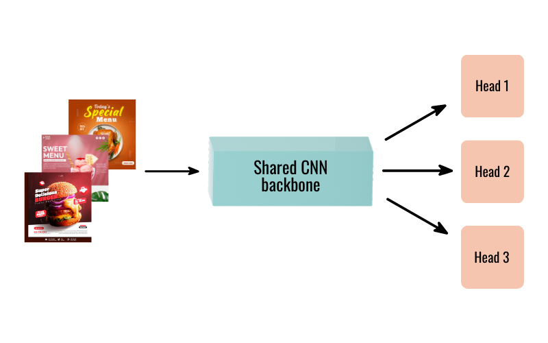

This multi-task CNN is designed to analyze food-related images from social media advertisements using multiple visual classification tasks.

A multi-task approach was chosen to evaluate how the model performs when learning multiple visual tasks simultaneously using a shared backbone. 
 

**Head 1**: Multi-class classification  
– Social media channel prediction  
– Accuracy: 96.13%

**Head 2**: Multi-label classification  
– Creator type prediction  
– Micro F1-score: 0.92

**Head 3**: Binary classification  
– Logo presence (yes/no)  
– Positive-class F1-score: 0.94

Dataset: 5,851 images  
– Training: 70%  
– Validation: 15%  
– Testing: 15%  
 
# Installation

This project was developed using Python 3.12.11

Required libraries:
- torch
- torchvision
- pandas
- numpy
- scikit-learn
- pillow
- tensorboard 
 

## How to Run
1. Clone the repository
2. Install dependencies
3. Run main.py 
 

Model overview(see below):

